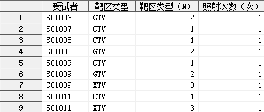
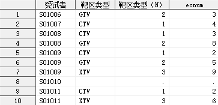

有如下两个数据集 `adsl` 和 `adex1`：

**adsl**

```sas
data adsl;
    input USUBJID $;
    label USUBJID = "受试者";
cards;
S01006
S01007
S01008
S01009
S01010
S01011
;
run;
```

**adex1**

```sas
data adex1;
    input USUBJID $ ECTVCAT $ ECTVCATN ECRN;
    label USUBJID  = "受试者"
          ECTVCAT  = "靶区类型"
          ECTVCATN = "靶区类型（N）"
          ECRN     = "照射次数（次）";
cards;
S01006 GTV 2 1
S01006 GTV 2 1
S01006 GTV 2 1
S01007 CTV 1 1
S01007 CTV 1 1
S01007 CTV 1 1
S01007 CTV 1 1
S01008 CTV 1 1
S01008 CTV 1 1
S01008 CTV 1 1
S01008 GTV 2 1
S01008 GTV 2 1
S01008 GTV 2 1
S01008 GTV 2 1
S01008 GTV 2 1
S01009 CTV 1 1
S01009 CTV 1 1
S01009 GTV 2 1
S01009 GTV 2 1
S01009 GTV 2 1
S01009 XTV 3 1
S01009 XTV 3 1
S01009 XTV 3 1
S01009 XTV 3 1
S01011 CTV 1 1
S01011 CTV 1 1
S01011 XTV 3 1
S01011 XTV 3 1
S01011 XTV 3 1
S01011 XTV 3 1
;
run;
```

现在需要衍生新的数据集 `adex3`，包含受试者筛选号、靶区类型、累积照射次数，其中靶区类型 `GTV` 的累积照射次数需要
在靶区类型 `CTV` 的累积照射次数上继续累加，靶区类型 `XTV` 的累积照射次数需要在靶区类型 `GTV` 的累积照射次数上继续累加。

> [!IMPORTANT]
>
> 可以看到 `CTV`, `GTV`, `XTV` 对应的变量 `ECTVCATN` 的值依次是 `1`, `2`, `3`，恰好是按照需要逐步累加的顺序安排的，这是
> 有意为之，便于后续使用不等号（`>=`, `<=`, ...）对数据集进行联结。

下面开始衍生 `adex3`：

1. 首先需要对 `adex1` 按照 `受试者筛选号` 和 `靶区类型` 进行去重。

   ```sas
   proc sort data = adex1 out = adex1_unique nodupkey;
       by USUBJID ECTVCAT;
   run;

   这一步生成的 `adex1_unique` 将用于后续与 `adsl` 进行左联结。
   ```

   `adex1_unique` 数据如下：

   

2. 将 `adsl` 与 `adex1_unique` 左联结，同时使用联结查询计算累积照射次数。

   ```sas
   proc sql noprint;
       create table adex3 as
           select
               adsl.usubjid,
               adex1_unique.ectvcat,
               adex1_unique.ectvcatn,
               (select sum(ECRN) from adex1 where adex1_unique.usubjid = adex1.usubjid and adex1_unique.ectvcatn >= adex1.ectvcatn) as ecnum
           from adsl left join adex1_unique on adsl.usubjid = adex1_unique.usubjid;
   quit;
   ```

   `adex3` 数据如下：

   

> [!IMPORTANT]
>
> 这里的关键步骤是 `adex1_unique.ectvcatn >= adex1.ectvcatn`，使用 `>=` 还是 `<=` 取决于 `靶区类型` 各类别对应数值变量的
> 大小关系，具体如下：
>
> - 如果 `CTV`, `GTV`, `XTV` 对应的变量 `ECTVCATN` 的值依次是 `1`, `2`, `3`，则使用 `adex1_unique.ectvcatn >= adex1.ectvcatn`；
> - 如果 `CTV`, `GTV`, `XTV` 对应的变量 `ECTVCATN` 的值依次是 `3`, `2`, `1`，则使用 `adex1_unique.ectvcatn <= adex1.ectvcatn`；
> - 其他情况，必须首先对变量 `ECTVCATN` 重新赋值，然后按照重新赋值后的顺序使用 `>=` 或 `<=`。
