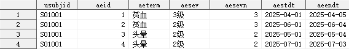

有如下数据：

```sas
data adae;
    input usubjid $ aeseq aeterm $ aesev $ aesevn aestdt yymmdd10. aeongo $ aeendt yymmdd10.;
    format aestdt aeendt yymmdd10.;
cards;
S01001 01 贫血 2级 2 2025-04-01 否 2025-04-02
S01001 02 贫血 3级 3 2025-04-02 否 2025-04-03
S01001 03 贫血 2级 2 2025-04-03 否 2025-04-04
S01001 04 贫血 1级 1 2025-04-04 否 2025-04-05
S01001 05 头晕 1级 1 2025-05-01 否 2025-05-02
S01001 06 头晕 2级 2 2025-05-02 否 2025-05-03
S01001 07 头晕 1级 1 2025-05-03 否 2025-05-04
S01001 08 贫血 1级 2 2025-06-01 否 2025-06-02
S01001 09 贫血 2级 3 2025-06-02 否 2025-06-03
S01001 10 贫血 1级 2 2025-06-03 否 2025-06-04
S01001 12 头晕 2级 1 2025-07-01 否 2025-07-02
S01001 13 头晕 1级 2 2025-07-02 否 2025-07-03
run;
```


其中的不良事件按照严重程度等级的变化分别记录，这里的关键信息是：**如果一条记录的结束日期和另一条记录的开始日期相同，且两条记录的不良事件名称一致，则说明这两条记录是同一次不良事件的两个阶段，它们之间仅存在严重程度的差异**。

现在需要利用以上关键信息识别这些属于同一次不良事件的记录，以便后续处理。

1. 首先按照 `受试者筛选号`，`不良事件名称`，`开始日期` 排序

   ```sas
   proc sort data = adae;
       by usubjid aeterm aestdt;
   run;
   ```

2. 标记每一次不良事件的开始，同时衍生两个新变量

   ```sas
   data adae;
       set adae;
       by usubjid aeterm aestdt;

       /*
       衍生两个新的 id
       aeid: 不良事件的 id
       aesevid: 不良事件严重程度记录的 id
       */
       retain aeid aesevid 0;

       format aeendt_lag yymmdd10.;

       aeendt_lag = lag(aeendt);
       if first.aeterm then do;
           new_flag = "Y";
       end;
       else do;
           /*如果当前记录的开始日期与上一条记录的结束日期不同，则是一条新的AE*/
           if aestdt ^= aeendt_lag then do;
               new_flag = "Y";
           end;
       end;

       if new_flag  = "Y" then do;
           aeid + 1;
           aesevid = 1;
       end;
       else aesevid + 1;
   run;
   ```

   这里有几个关键点：

   - `lag()` 函数用于获取某个变量上一次观测的值，便于比较当前记录的开始日期和上一条记录的结束日期，如果当前记录的开始日期和上一条记录的结束日期不同，就说明当前记录已经是一条新的不良事件了（即便此时的不良事件名称没有发生变化），此时将 `new_flag` 变量的值赋值为 `Y`；
   - `aeid` 变量是不良事件的 id；
   - `aesevid` 变量是不良事件严重程度记录的 id；

   运行结果：
   

3. 通过 `aeid` 和 `aesevid` 继续处理，比如筛选最早的开始日期、最晚的结束日期、最高的严重程度等级

   ```sas
   proc sql noprint;
       create table adae_unique as
           select
               a.usubjid,
               a.aeid,
               a.aeterm,
               (select max(aesevn) from adae as b where a.usubjid = b.usubjid and a.aeid = b.aeid) as aesevn,
               (select min(aestdt) from adae as b where a.usubjid = b.usubjid and a.aeid = b.aeid) as aestdt format = yymmdd10.,
               (select max(aeendt) from adae as b where a.usubjid = b.usubjid and a.aeid = b.aeid) as aeendt format = yymmdd10.
           from
               (select distinct usubjid, aeid, aeterm from adae) as a;
   quit;
   ```

   运行结果：
   
